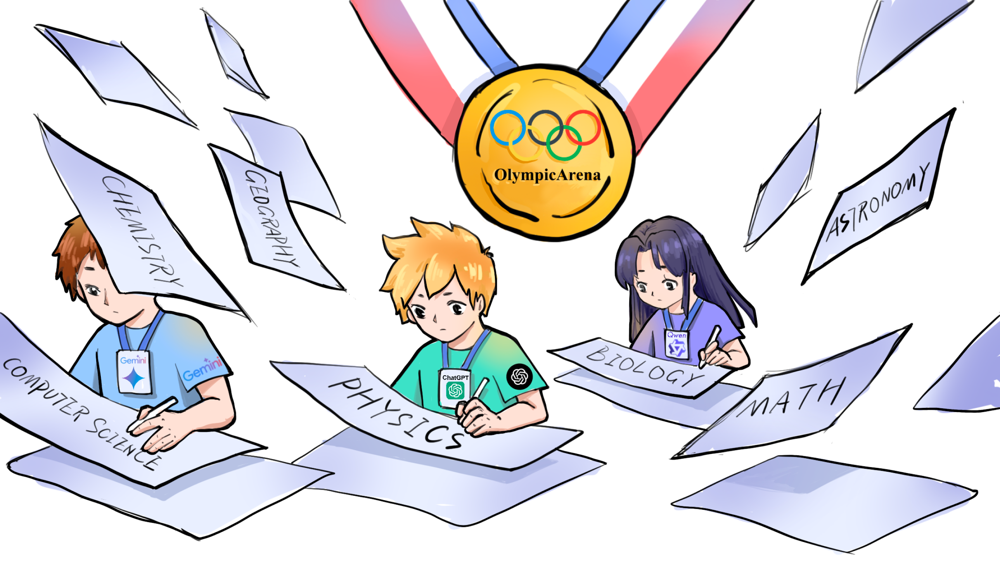

# OlympicArena: Benchmarking Multi-discipline Cognitive Reasoning for Superintelligent AI

<p align="center">        </p>

<p align="center">
  📄 <a href="https://arxiv.org/pdf/2406.12753" target="_blank">Paper</a> &nbsp; | &nbsp;
  🤗 <a href="https://huggingface.co/datasets/GAIR/OlympicArena" target="_blank">Hugging Face</a> &nbsp; | &nbsp;
  🌐 <a href="https://gair-nlp.github.io/OlympicArena/" target="_blank">Website</a> &nbsp; | &nbsp;
  📤 <a href="#submit-your-result" target="_self">Submit</a> &nbsp; | &nbsp;
  📘 <a href="https://mp.weixin.qq.com/s/M16i34Vejq9DruMvfYsOtA" target="_blank">机器之心</a>
</p>

## 🔥News

- [2024/09/26] Our paper has been accepted by NeurIPS D&B Track 2024 🎉
- [2024/07/12] We have updated our submission platform. Firstly, the entire submission process is now anonymous; only the user can see their submitted scores, and they will not be visible to others. Secondly, we now support submissions via the command line.
- [2024/06/27] We add the result of the Deepseek-Coder-V2 model to the leaderboard, and it demonstrates outstanding performance in Maths and CS!
- [2024/06/26] We test ByteDance's Doubao-pro-32k model and find that it achieves remarkably high scores on Chinese problems.
- [2024/06/24] A brand new technical report comparing the performance of Claude-3.5-Sonnet and GPT-4o on OlympicArena has been released at [this link](https://arxiv.org/pdf/2406.16772) and [机器之心](https://mp.weixin.qq.com/s/YdGPDE5Jgp3vnWCxrwMsgA).
- [2024/06/22] We test the latest Gemini-1.5-Pro and Claude-3.5-Sonnet models and add them to the leaderboard.
- [2024/06/20] Our work is featured by [机器之心](https://mp.weixin.qq.com/s/M16i34Vejq9DruMvfYsOtA) on Wechat!


## Contents

- [Introduction](#introduction)
- [How to use?](#how-to-use)
  - [Setup](#setup)
  - [Load Data](#load-data)
  - [Inference](#inference)
  - [Evaluation](#evaluation)
  - [Submit your result](#submit-your-result)
- [Citation](#citation)


## Introduction

<p align="center">        </p>

**OlympicArena** is a comprehensive, highly-challenging, and rigorously curated benchmark featuring a detailed, fine-grained evaluation mechanism designed to assess advanced AI capabilities across a broad spectrum of Olympic-level challenges. We aim to advance AI towards superintelligence, equipping it to address more complex challenges in science and beyond.

## How to use?

### Setup

To begin using the OlympicArena benchmark, you need to install the required dependencies. You can do this by running the following command:

```bash
git clone https://github.com/GAIR-NLP/OlympicArena.git
pip install -r requirements.txt
```

If you need to define your own model for inference or evaluation, you will also need to install any additional packages required by your model (e.g., transformers). 

### Load Data

We have released the data for seven disciplines on [Hugging Face](https://huggingface.co/datasets/GAIR/OlympicArena). Each discipline is divided into val and test splits. The val split includes the answers for small-scale testing, while the answers for the test split are not publicly available. You can submit your results to our platform for evaluation (refer to [Submit your result](#submit-your-result)).

Loading the data is very simple. You can use the following code snippet:

```python
from datasets import load_dataset

# Load the dataset for a specific discipline, e.g., Math
dataset = load_dataset("GAIR/OlympicArena", "Math", split="val")

print(dataset[0])
```

Each data entry contains the following fields:

- `id`: The unique identifier for each problem
- `problem`: The problem statement
- `prompt`: The prompt used as input to the model (as used in the paper); we also encourage users to try their own prompts
- `figure_urls`: Links to images that appear in the problem, in order
- `answer`: The answer to the problem
- `answer_type`: The type of the answer
- `unit`: The unit corresponding to the answer
- `answer_sequence`: The sequence in which the model should provide answers if multiple quantities are required
- `type_sequence`: The sequence of `answer_type` for each quantity if multiple quantities are required
- `test_cases`: Test cases used for evaluation in CS code generation problems
- `subject`: The subject of the problem
- `language`: The language of the problem, where EN represents English and ZH represents Chinese
- `modality`: The modality type of the problem statement, where `text-only` indicates the problem statement does not contain images, and `multi-modal` indicates the problem statement contains images


If you only want to use a specific subset of our dataset (e.g., only English problems, or only text-only problems), you just need to modify the load_data code snippet ([./code/utils.py](./code/utils.py)):

```python
def load_data(hf_data_path, split, language=None, modality=None):
    subjects = ["Math", "Physics", "Chemistry", "Biology", "Geography", "Astronomy", "CS"]
    datasets = []
    for subject in subjects:
        dataset = load_dataset(hf_data_path, subject, split=split)
        if language:
            dataset = dataset.filter(lambda x: x['language'] == language)
        if modality:
            dataset = dataset.filter(lambda x: x['modality'] == modality)
        
        datasets.append(dataset)
    return concatenate_datasets(datasets)
```

### Inference

To run inference, first navigate to the code directory:
```bash
cd code
```

Then, execute the following command to run the inference script:

```bash
python inference.py \
    --hf_data_path GAIR/OlympicArena \
    --model_output_dir ./model_output/ \
    --split val \
    --model gpt-4o \
    --batch 15 \
    --api_key YOUR_API_KEY \
    --base_url YOUR_BASE_URL \
    --save_error
```

- `--hf_data_path`: Path to the Hugging Face dataset (default: "GAIR/OlympicArena")
- `--model_output_dir`: Directory to save the model output (default: "./model_output/")
- `--split`: Dataset split to use for inference, either "val" or "test"
- `--model`: Model name to use for inference
- `--batch`: Batch size for inference
- `--api_key`: Your API key, if required
- `--base_url`: Base URL for the API, if required
- `--save_error`: Save errors as None (default: False). If set, any problem that fails or encounters an error during inference will be saved with an answer of `None`.

After inference is complete, a JSON file containing the inference outputs will be generated in `model_output_dir/model`, which can be used for evaluation.

If you want to use your own model for inference, you can enter the `model` folder and define your model as a subclass of `BaseModel`.


### Evaluation

You can only run evaluation locally on the val set (because the answers for the test set are not publicly available). First, ensure that the corresponding JSON file representing the inference outputs is generated in the inference step.

Then you can execute the following script from the command line:

```bash
python evaluation.py \
     --hf_data_path GAIR/OlympicArena \
     --model_output_dir ./model_output/ \
     --result_dir ./result/ \
     --split val \
     --model gpt-4o
```

Finally, we will print the overall accuracy, accuracy for different subjects, accuracy for different languages, and accuracy for different modalities.

### Submit your result

If you want to test your own model's performance on the test set, you can use our submit platform.

Two different submission methods are supported:

1. Direct Submission on the Platform:

- Go to the [submission platform](https://huggingface.co/spaces/GAIR/OlympicArenaSubmission).

- Click "login in with Hugging Face" on the competition page then upload your result file.

2. Command Line Submission:

- First, install the required library:

    ```bash
    pip install git+https://github.com/huggingface/competitions
    ```

- Then use the following command:

    ```bash
    competitions submit --competition_id GAIR/OlympicArenaSubmission --submission YOUR_RESULT_JSON_PATH --comment COMMENT --token YOUR_HF_READ_TOKEN
    ```

Detailed format instructions are available on the submission platform. We strongly recommend using the code framework provided in this repository for inference, as it will generate the required JSON file that can be directly submitted to the platform.

### Annotation Interface

We also provide the data annotation interface used in this work for reference or use. You can check the details by navigating to the `annotation` directory.

```bash
cd annotation
```


## Citation

If you encounter any question about our work, please do not hesitate to submit an issue or directly contact us via email [gair.olympicarena@gmail.com](mailto:gair.olympicarena@gmail.com).

If you do find our code helpful or use our benchmark dataset, please citing our paper.

```
@article{huang2024olympicarena,
      title={OlympicArena: Benchmarking Multi-discipline Cognitive Reasoning for Superintelligent AI},
      author={Zhen Huang and Zengzhi Wang and Shijie Xia and Xuefeng Li and Haoyang Zou and Ruijie Xu and Run-Ze Fan and Lyumanshan Ye and Ethan Chern and Yixin Ye and Yikai Zhang and Yuqing Yang and Ting Wu and Binjie Wang and Shichao Sun and Yang Xiao and Yiyuan Li and Fan Zhou and Steffi Chern and Yiwei Qin and Yan Ma and Jiadi Su and Yixiu Liu and Yuxiang Zheng and Shaoting Zhang and Dahua Lin and Yu Qiao and Pengfei Liu},
      year={2024},
      journal={arXiv preprint arXiv:2406.12753},
      url={https://arxiv.org/abs/2406.12753}
}
```
