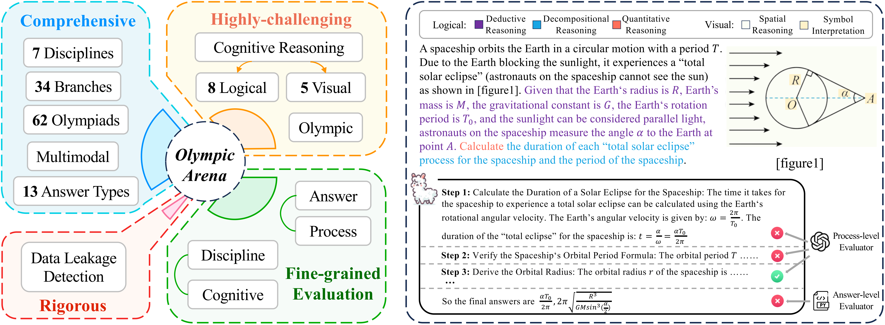

# OlympicArena: Benchmarking Multi-discipline Cognitive Reasoning for Superintelligent AI

        

  🤗 <a href="https://huggingface.co/datasets/GAIR/OlympicArena" target="_blank">Hugging Face</a>

## Introduction

**OlympicArena** is a comprehensive, highly-challenging, and rigorously curated benchmark featuring a detailed, fine-grained evaluation mechanism designed to assess advanced AI capabilities across a broad spectrum of Olympic-level challenges. We aim to advance AI towards superintelligence, equipping it to address more complex challenges in science and beyond.

