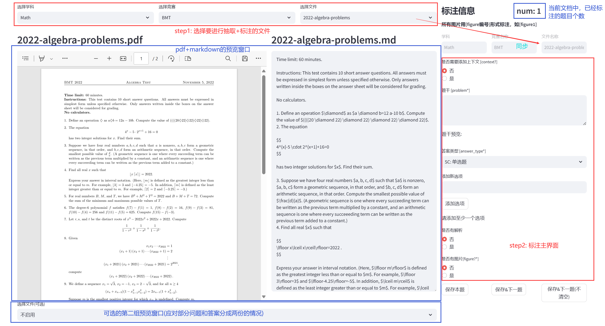
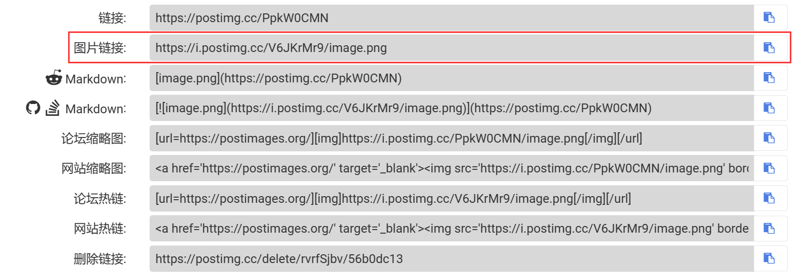
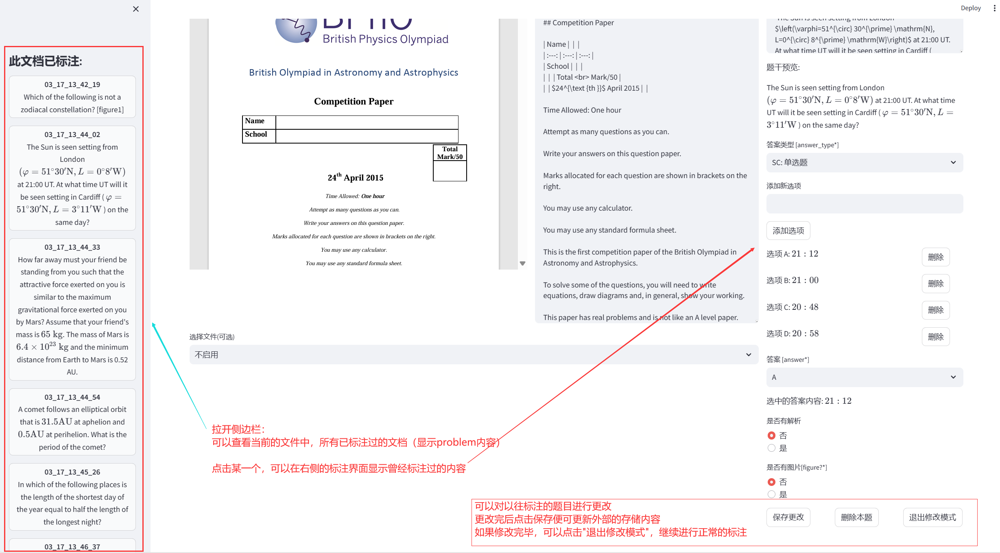

# 环境设置

请确保您的环境中已安装以下软件包：

```bash
pip install streamlit
```

**推荐使用 Firefox 浏览器以避免兼容性问题**，特别是在渲染较大的 PDF 文件时。可以通过以下链接下载并安装 Firefox 浏览器：[Mozilla Firefox 官方网站](https://www.firefox.com.cn/)。Edge 和 Chrome 浏览器在渲染较大的 PDF 文件时会遇到问题。

# 准备待标注文件

在开始之前，请在当前工作目录中创建一个名为 `data` 的文件夹，并按以下结构组织您的文件：(具体data文件在项目的google drive中)

```
data
├── Math
│   ├── BMT
│   ├── COMC
│   └── ...
├── Physics
└── ...
```

这将确保程序能正确地定位并组织您的文件。

# 启动应用

设置完成后，在终端中运行以下命令以启动应用：

```bash
streamlit run main.py
```

按照指示，在您的网页浏览器中打开应用。如果一切设置正确，您应该能够看到应用的主界面。

# 使用说明

## 界面总览


## 使用步骤
### 1. 选择文件
选取 （学科，竞赛，文件），界面会自动显示文件的pdf和markdown预览。
通常来说，文件名中的Q表示题目，A表示解答，QA表示题目和解答都有；其他一些文件名称可能会略有不同，可以自行甄别。

选取完文件后，右侧的标注界面，会自动锁定目前正在标注的文件。

**所有标注的输出以 ./学科名/竞赛简称/文件名称/日期标志.json  存储在 ./output/ 文件夹。(一题一个json)**

### 2. 选择题型
本系统支持以下的题型：
| 简称  | 答案类型       | 说明                                       |
|-----|------------|------------------------------------------|
| SC  | 单选题        | 正确答案仅有一个选项的选择题（四选一、五选一...） |
| MC  | 多选题        | 正确答案有多个选项的选择题（四选二、五选二、六选二...）            |
| TF  | 判断题        | 答案为True/False                            |
| NV  | 数值题        | 答案为一个数值，一些特殊数值如$\pi$, $e$, $\sqrt{7}$, $log_29$等等，用tex表示 |
| SET | 集合         | 答案为集合，如{1, 2, 3}                         |
| IN  | 区间         | 答案为某个取值范围，写成区间的形式，用tex表示                 |
| EX  | 表达式        | 含字母的表达式，用tex格式表示                         |
| EQ  | 方程         | 含字母的方程式，用tex格式表示                         |
| TUP | 元组         | 通常表示要求的数对，例如(x, y)                       |
| MPV | 一题多个待求量    | 一个小问题中，要求不止一个量，例如:一道物理大题的第一小问，要同时求出速度和时间 |
| MA  | 一题多个答案     | 一个小问题中，有多个解（即考察是否考虑周全），例如：一个数学填空题答案为1或-2 |
| OT  | 其他（需要人类评估） | 一些不太好自动化评估的题型，如化学方程式书写、理由阐述题等，需要人类专家评估   |

**ps: 一题多个待求量和一题多个答案两种模式中，每一个量可以是前面的数值、区间、表达式、方程、集合、元组。（在标注界面中是有这个选项的）**

### 3. 标注（**纯英文标注**）
- 上下文：部分题目需要依赖之前小问的一些结论或者信息才能更好地解答下一小题，如一道有3个小问的物理解答题，可能第3问需要依赖于前面2个小问的铺垫才能更容易解决。因此，上下文字段，需要您自行归纳、补充一些先前得出的结论、信息（例如，可以拷贝前几问的solution或者答案）
- 题干：题目描述（**注意，不要带有试卷上的一些题号、无关标识符，如1. 2. 3**），标注完成后可以查看预览是否符合tex语法格式，如果发现出现报错/错误，可以利用pdf原件，自行使用[mathpix](https://mathpix.com/)(付费)或者[latexlive](https://www.latexlive.com/)(免费)进行重新解析、矫正。
- 答案：根据不同题型的要求标注([详见](#不同题型的标注要求))
- 解析：如果所给的文件中，对一道题不仅有标准答案，还有详细的解析，需要标注这一项(不要包含一些无关字符、表示，如【Solution】)
- 图片：如果一道题的题干/选项（如果是选择题）/解析 有图片，需要标注这个字段。
**在题干/选项（如果是选择题）/解析中的图片，以[figure1] [figure2] ... 的格式表示**，编号为该题的局内编号，从1开始。具体而言，图片的标注包括：
  - 是否依赖图片：即思考假设去掉这张图片，这道题是否还可以做。

  - 图片链接：顺序与前面的[figure1] [figure2] ... 一致，依次添加图片的链接(输入链接，系统展示图片预览，您再选择图像类型的标注)。
  
  注意：在markdown文件中通常有mathpix的图像链接，假设发现pdf中有的图片在markdown版本中没有对应的链接，用[postimages](https://postimages.org/)生成图片链接


  - 图像类型：选取图像类型

  注意：每添加完一张图片，标注系统会显示图片预览，如果发现mathpix链接的图片并不是正确对应这道题的，可以用[postimages](https://postimages.org/)重新截取、生成链接


#### 不同题型的标注要求
- 单选题、多选题、判断题

  只要依次添加选项，选择正确选项就行
- 数值题

  简单的可以直接填写数字，复杂的、带特殊符号的用tex表示，如`$e^{i \pi}+1$`用来表示$e^{i \pi}+1$

  如果这个数值有单位，例如物理、化学中，m/s  mol/L 等，在单位一项中填写；如果没有单位，直接空着即可
- 集合题

  用 `{}` 包裹即可，例如 `{1, 2, $e$, $log _2 3$}`表示{1, 2, $e$, $log _2 3$}

- 区间、表达式、方程

  与数值题类似，都是用tex表示

- 元组

  通常是数对（在数学中偶尔会出现），例如: 求满足条件的$(x, y)$，答案为$(2, 3)$

- 一题多个待求量

  需按照标注系统的规则，依次添加每一个待求量的信息（**填完一组名称、类型、答案、单位后，点击"添加待求量"，即增加了一项**）。
  
  其中，名称一项填写对待求量的描述（后续要用在prompt里引导模型的输出）

- 一题多个答案

  按照标注系统的规则填写即可（**填完一组答案、类型、单位后，点击"添加答案"，即增加了一项**）
  
- 其他（需要人类评估）

  不在上述的范畴中，没有一个符合上述格式的答案类型与之匹配，例如书写化学方程式、简单的阐述题（如：判断这辆车是加速还是减速）。需标注问题场景（用于后续用大模型模拟人类老师批改题目时，给予的提示词）、参考答案、解析（如果有的话）

  **证明题、偏文科的长段主观题不需要抽取！！！**

#### 其他一些注意事项/技巧
- 一些题干有明显的时间信息，如"今年..."，需要结合试卷的年份（通常文件名就可以体现），做一些微改
- 注意区分一题多解和一题多问，可以参考[上表](#2-选择题型)例子来辨别
- 一道大题，分为(1)(2)(3)小题时，一般是把(1)(2)(3)小题作为单独的题目来标注，只不过如果这些小题有相互的依赖，可以用[上下文]字段进行标注
- 有些试卷，如生物竞赛(IBO)中，会出现一个背景材料，下面给5-6个说法，判断正确/错误的，这类题目可以将这5-6个说法结合起来，改为一个多选题: Select the correct statements below (there may be more than one).
- 实在难以标注的题目，可以跳过。**标注的原则是准确完整、自洽即可，在此基础上，可以灵活变通！**

### 4. 保存
所有标注的输出以 ./学科名/竞赛简称/文件名称/日期标志.json  存储在 ./output/ 文件夹。
标注界面有三个保存相关的按钮：
- 保存本题：暂存本题，修改标注信息后可以再次点击保存
- 保存&下一题：保存本题，开始下一题标注，上一题填写的标注信息在页面上被清空
- 保存&下一题(不清空)：保存本题，开始下一题标注，上一题填写的标注信息依然留在页面上（这个设计是为了方便一个多小问的大题的标注，一些图片、题干可能几个小题都要使用）

### 5. 修改模式

如果当前的文档，您已经标注过一些内容，并想对过去标注的某些题目做修改，可以展开做左侧的侧边栏。
侧边栏会显示当前文档中，您标注过的所有题目（以外部保存文件名+题目内容的板块显示每道题目）

点击您想进行修改的题目，系统会进入“修改模式”，并在右侧的标注栏载入您所选的题目的标注内容，便可以进行修改。

修改完毕后，点击保存，便可以更新该题的标注。

点击“退出修改模式”，可以继续进行正常的标注。

点击“删除本题”，可以删除这道题的外部存储文件。
